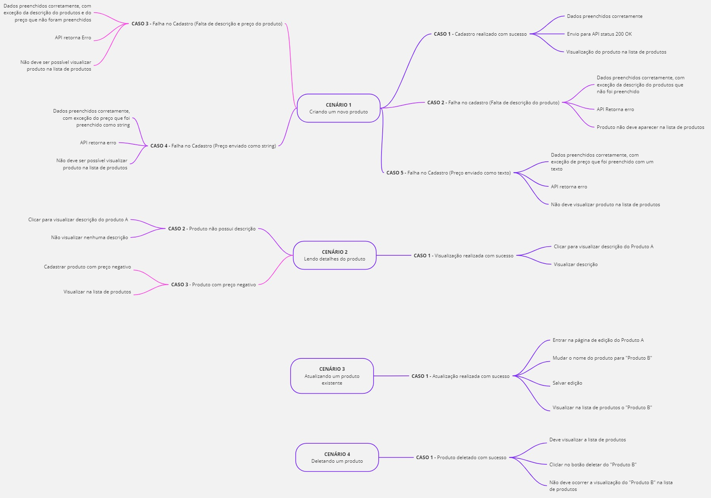

# ALPE-Challenge


## 💻 Pré-requisitos

Antes de começar, verifique se você atendeu aos seguintes requisitos:

- Fazer a instalação do `<NodeJS versão 20.9.0>` </br>
  Caso não tenha o node instalado, <a href="https://www.freecodecamp.org/portuguese/news/como-instalar-o-node-js-e-o-npm-no-windows/"> clique aqui</a>
- Fazer instalação de um `<editor de código>`, como por exemplo o Visual Studio Code utilizado no projeto </br>
  Caso não tenha o Visual Studio Code instalado, <a href="https://code.visualstudio.com/download">clique aqui</a>
- Fazer instalação do `<Git`> para clonar nosso repositório </br>
  Caso não tenha o Git instalado, <a href="https://git-scm.com/book/pt-br/v2/Come%C3%A7ando-Instalando-o-Git">clique aqui</a>


## 📖 Guia do projeto

Para entender melhor sobre o projeto, acesse primeiramente a pasta [doc](./doc) onde você pode encontrar: </br>

- [Documento de Especificação dos Casos de Teste](./doc/CASOS-DE-TESTE.pdf)

## 🚀 Instalando Projeto

Para instalar o projeto, siga estas etapas:

Primeiro de clone com o comando:
```
git clone https://github.com/BiellSouza2005/ALPE-Challenge.git
```
Entre na pasta do projeto e escreva os seguintes comandos no terminal para instalar as dependências do projeto com o comando:
```
npm install
```
## ☕ Start

Após ter instalado todas as dependências, execute o projeto com:
```
npx cypress open
```
## 🔭Importante

Sempre que for testar um caso em algum cenário, é importante fazer a limpeza dos dados com o arquivo <strong>DeletingProducts</strong></br>
Depois desses comandos, acesse o cypress e teste os cenários.

## 🤝 Colaborador

<table>
  <tr>
    <td align="center">
      <a href="https://github.com/biellSouza2005" title="GitHub do Gabriel Souza">
        <br>
        <sub>
          <b>Gabriel Souza</b>
        </sub>
      </a>
    </td>
  </tr>
</table>
